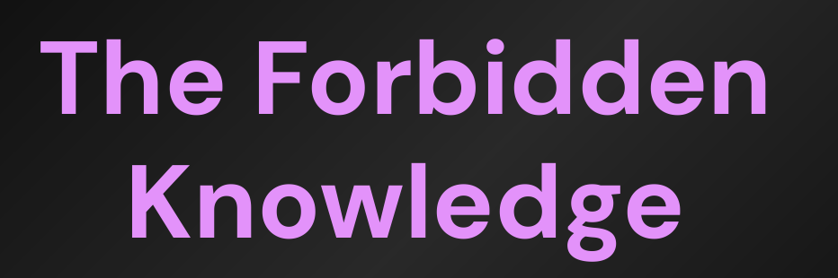
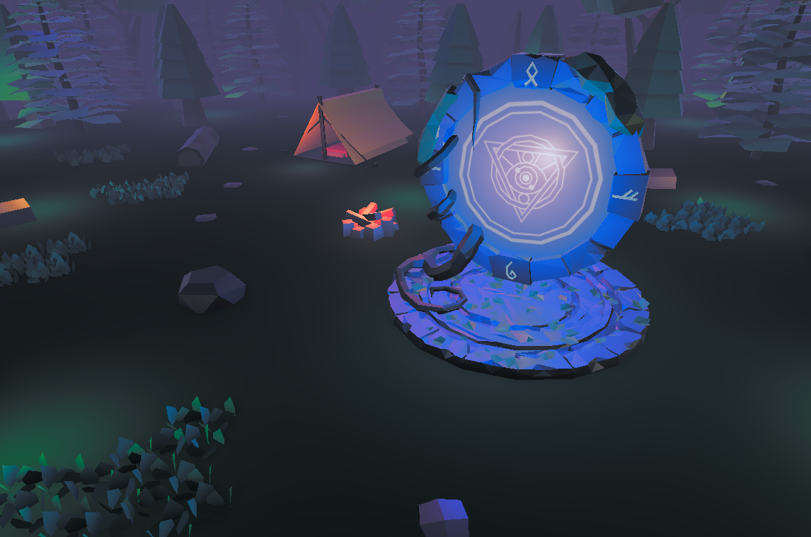
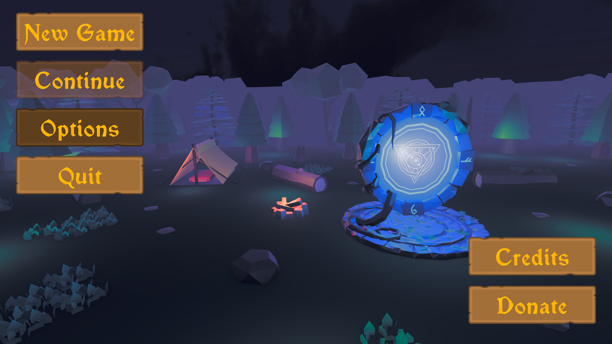
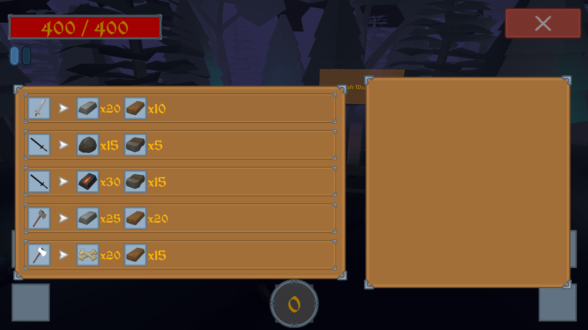
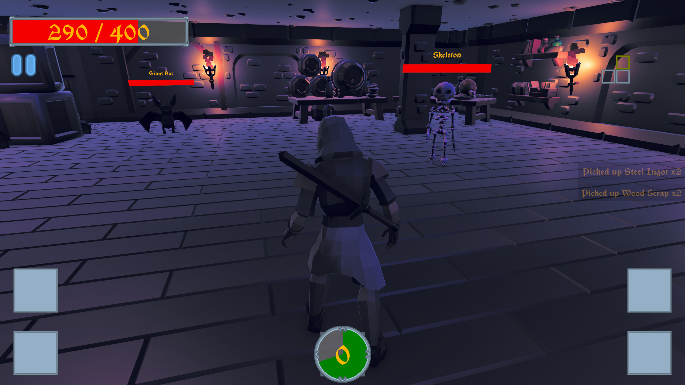
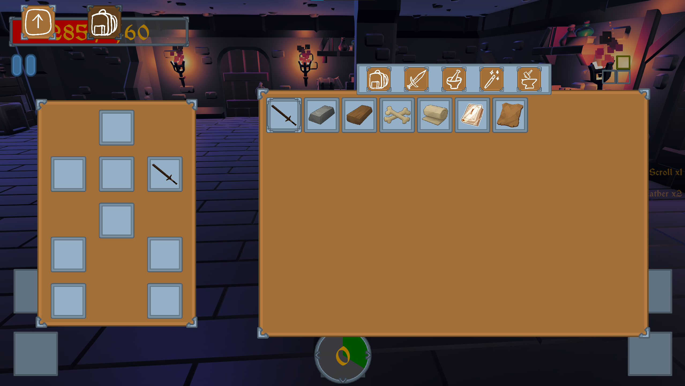

 
  

<h1 align="center"> The Forbidden Knowledge </h1>
<h3 align="center"> Project for: <a href="https://www.polsl.pl/en/">Silesian University of Technology</a></h3>

<h2>About The Project</h2>

 
  This project was made for the 6th semester Computer Graphics course at my university. 

 
  It is a roguelike, dungeon crawler game, set in the fantasy world, where the player explores the randomly generated dungeons filled with monsters in order to uncover the truth about their origin.

 
  Players can upgrade their stats, craft items, spells. And of course, fight hordes of monsters in the dungeons, including much more challenging bosses.

 
  Using variety of weapons, spells and items, players can steadily improve their chances of winning and learning about the purpose of their struggle.

<h2>Instalation</h2>

<h3>Project</h3>

- Clone the repository into your local machine
- Install the required Unity version
- Open the project

<h3>Release</h3>

- Download the release version
- Unpack the zip archive
- Launch the executable

<h2>Usage</h2>

- When the game is launched, players start in the main menu
- They can check out the settings, controls and credits
- When they want to start the game, they press the New Game button and, if they have the save, press the Continue button

<h2>Gameplay Screenshots</h2>

  

  

  

  

  

